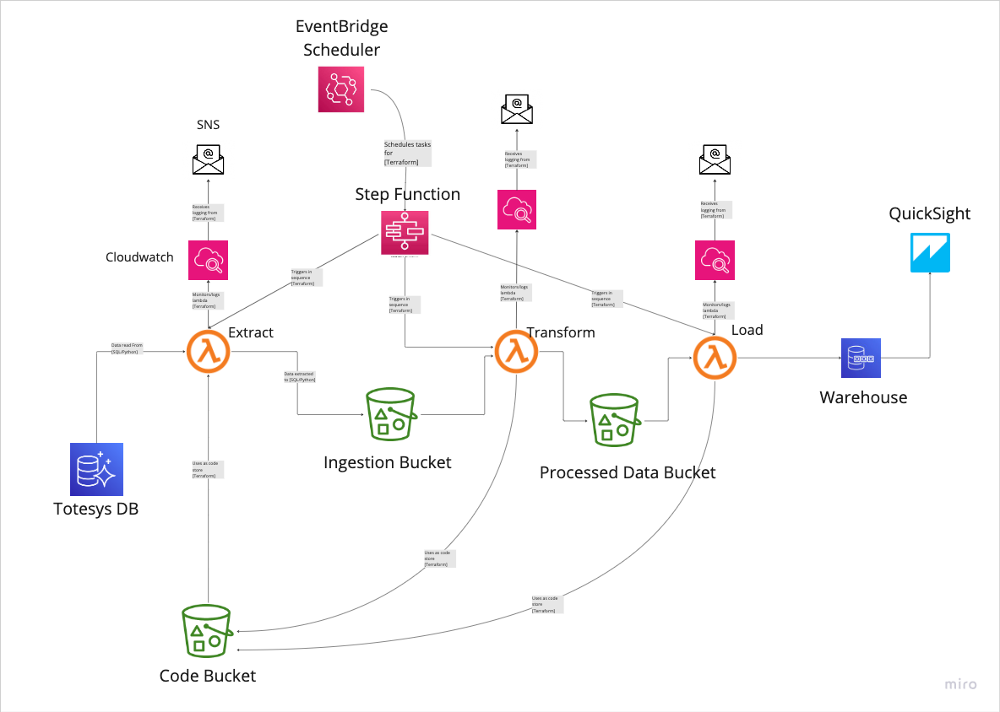

# Totesys Datate Pipeline
Data pipeline to move data from Totesys OLTP database to OLAP database for BI.

## Description
Move data from a ralational OLTP database into a OLAP databased stored in star schema every 20 minutes. The data pipeline consists of three ETL stages.

## Pipeline Diagram

### Extract
Take the data from the OLTP database and stored teh data in JSON format in an S3 bucket
### Tranform
Tranform the JSON data into a star schema and store in parquet format
### Load
Loads the data into end OLAP database

## Built With
### AWS Cloud
- Lambda
- Step-function
- CloudWatch
- EventBridge
- S3
- RDS
- Quicksight
- SNS

### Terraform
- Build cloud indrastructure

### Python
- Code for Lambda functions

## Roadmap
- [ ] Upload data into final warehouse
- [ ] Add business intelligence 
- [ ] Refactor
- [ ] Optimise

## Authors
- Heiman
- Leonette
- Michael
- Mostyn
- Nicholas